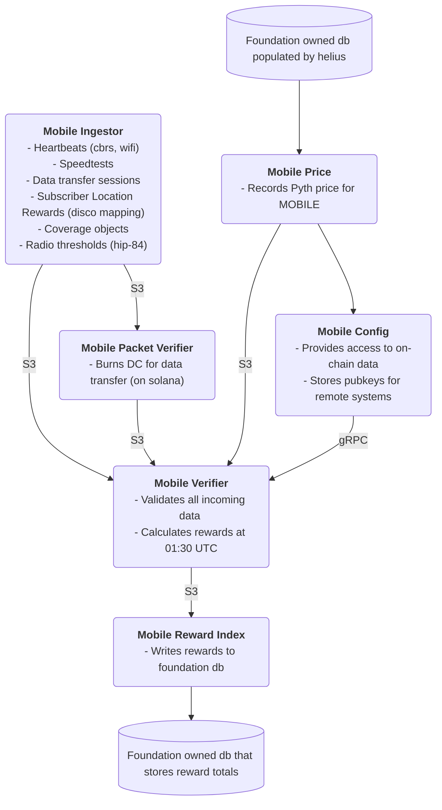

# Oracles

## Mobile

```mermaid
flowchart TD
    MI("`**Mobile Ingestor**
        - Heartbeats (cbrs, wifi)
        - Speedtests
        - Data transfer sessions
        - Subscriber Location Rewards (disco mapping)
        - Coverage objects
        - Radio thresholds (hip-84)
    `")
    MV("`**Mobile Verifier**
        - Validates all incoming data 
        - Calculates rewards at 01:30 UTC
    `")
    MPV("`**Mobile Packet Verifier**
        - Burns DC for data transfer (on solana)
    `")
    MB("`**Mobile Price**
        - Records Pyth price for MOBILE
    `")
    DB1[(Foundation owned db populated by helius)]
    MC("`**Mobile Config**
        - Provides access to on-chain data
        - Stores pubkeys for remote systems
    `")
    MRI("`**Mobile Reward Index**
        - Writes rewards to foundation db
    `")
    DB2[(Foundation owned db that stores reward totals)]
    MI -- S3 --> MV
    MI -- S3 --> MPV
    MPV -- S3 --> MV
    MB -- S3 --> MV
    DB1 --> MB
    MB --> MC
    MC -- gRPC --> MV
    MV -- S3 --> MRI
    MRI --> DB2
```