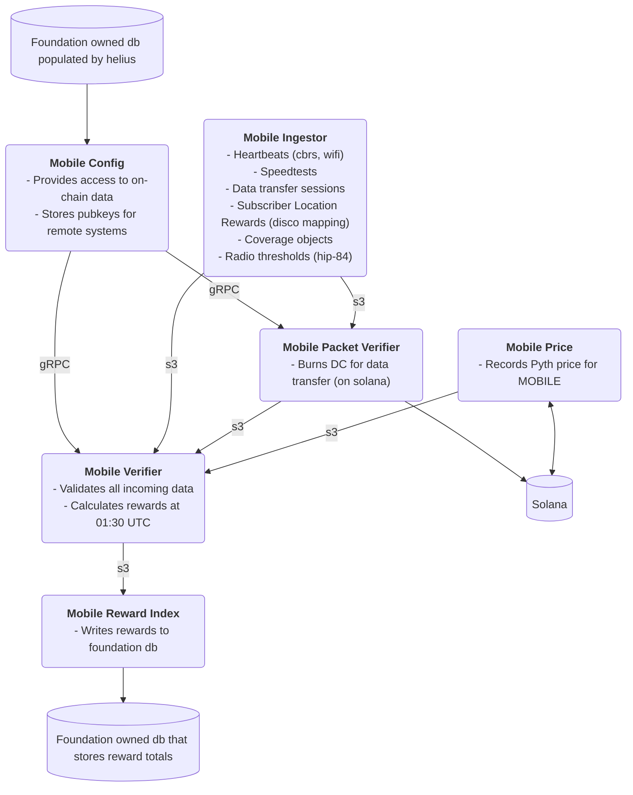

# Helium Mobile Oracles [](https://github.com/helium/oracles/actions/workflows/CI.yml)

Oracles for the Helium Mobile Network.

> **Note**: This repository was split from the main [helium/oracles](https://github.com/helium/oracles) repository. For IoT oracles, see [helium/oracles-iot](https://github.com/helium/oracles-iot).

## Architecture



## Components

### Mobile Verifier
Validates all incoming data (heartbeats, speedtests, data transfer sessions, subscriber location rewards, coverage objects) and calculates rewards at 01:30 UTC.

### Mobile Config
Configuration APIs for Mobile subnetwork - provides access to on-chain data and stores public keys for remote systems.

### Mobile Packet Verifier
Packet verification - burns Data Credits for data transfer on Solana.

### Supporting Services
- **Ingest**: Data ingest server for Mobile network (heartbeats, speedtests, coverage objects)
- **Price**: Price oracle for MOBILE token
- **Reward Index**: Writes rewards to foundation database
- **PoC Entropy**: Creates entropy for mobile network operations

## Shared Libraries

This repository includes shared infrastructure libraries:

- `file-store` and `file-store-oracles`: File-based storage abstractions
- `db-store`: Database storage layer
- `task-manager`: Task scheduling and management
- `custom-tracing`: Tracing utilities
- `metrics`: Metrics collection (poc-metrics)
- `tls-init`: TLS initialization
- `price-tracker`: Price tracking utilities
- `reward-scheduler`: Reward scheduling
- `solana`: Solana blockchain integration
- `denylist`: Denylist management

## Development

### Building

```bash
cargo build --release
```

### Testing

```bash
cargo test --workspace
```

## Deployment

Mobile services are built as Docker images and deployed via the CI/CD pipeline. Images are pushed to GitHub Container Registry (GHCR) and then to AWS ECR for production deployment.

## Multi-Mode Applications

Some applications in this repository (ingest, price, reward_index, poc_entropy) contain code for both IoT and Mobile networks. IoT-specific code will be pruned in future updates.
