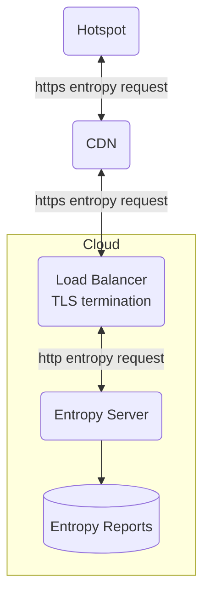

# Entropy Server

The entropy server serves up entropy data for hotspot beacons to ensure that
hotspots are online and avoid scripted replay attacks.

It is used primarily by the IoT hotspot PoC mechanism.

The entropy server

- Generates entropy on a regular interval (60s). The entropy can be sourced from
  any secure, reliable online source. The initial implementation relies on a
  Solana JSON-RPC source over TLS to collect Solana block hashes as entropy.
- Stores and uploads [generated
  entropy](https://github.com/helium/proto/blob/master/src/entropy.proto) to a
  bucket for use by verifier(s)
- Serves entropy over http

The [figure below](#fig-entropy-server) illustates the server in a deployment setup.

Note that TLS termination is required and regionalised CDN is highly recommended
to expose the server publicly.

<div align = "center" markdown = 1 id="fig-entropy-server">



</div>

## Endpoints

The entropy server exposes the following endpoints.

### `/health`

Health check for use by the load balancer

### `/entropy`

Fetches currently active entropy. The returned `data` is a base64 encoded array
of entropy data. The `timestamp`has a unix epoch timestamp at which the entropy
started.

The `cache-control` response header is set to indicate how long the entropy is
still active for (in seconds). This is used by the CDN to refresh edge cached
entropy values.

```json
{
  "data": "St6vWMe4FfFJGeJDfcxkRizqE48mnaps/6LFp0FHVuc=",
  "timestamp": 1662927759
}
```

## Configuration

The following environment variables are used by the server:

| Name                    | Value                                     | Default           |
| ----------------------- | ----------------------------------------- | ----------------- |
| API_SOCKET_ADDR         | Listen address for http api               | 0.0.0.0:8080      |
| METRICS_SCRAPE_ENDPOINT | Metrics scrape url                        | 0.0.0.0:9000      |
| ENTROPY_STORE           | Absolute path for temporary entropy store | /var/data/entropy |
| ENTROPY_URL             | URL for entropy request                   |                   |
| BUCKET                  | Bucket to send entropy values to          |                   |
