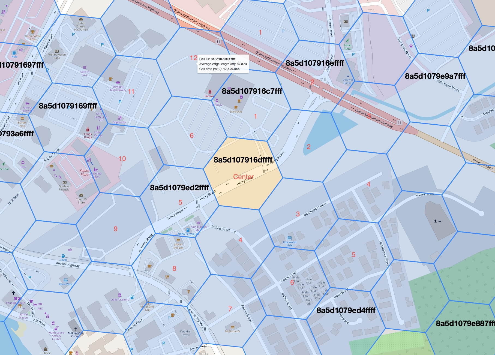

# Mobile Stack Testing

# Setup

## 1. Generate data

**NOTE:** Data is auto generated if you do no wish to change it skip these steps. The commands are here to show how the data is generated.

- `test-mobile assignment` and move generated files [^files] to `docker/mobile/localstack/data/mobile-verifier-data-sets/`
- `test-mobile price` and move generated file to `docker/mobile/localstack/data/mobile-price/`

## 2. Build Docker images

- `cd docker && docker compose build`

## 3. Run test

- `cargo test --package test-mobile --test integration_test -- --nocapture`

**NOTE:** The test will `docker compose up` on start and `docker compose stop` at the end, it is up to **you** to `docker compose down` if you want to clean up.

[^files]: Maps of hexes used 

